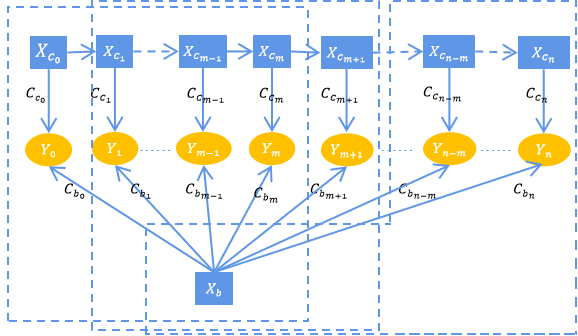
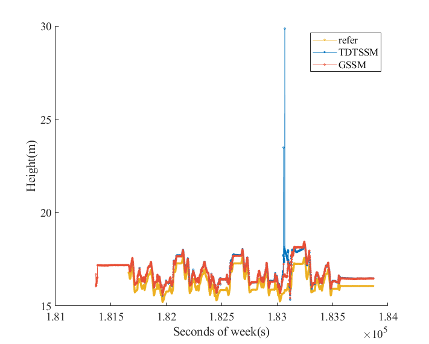
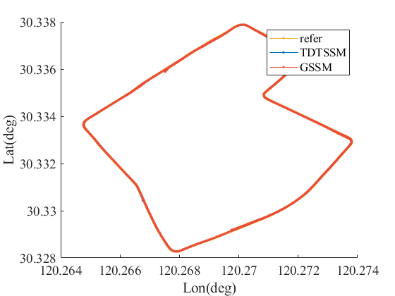
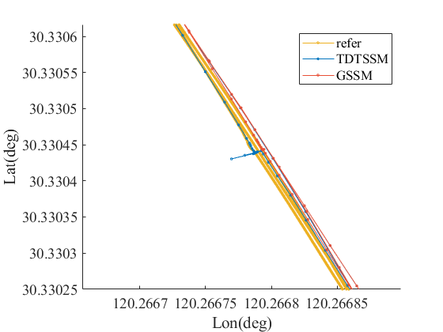
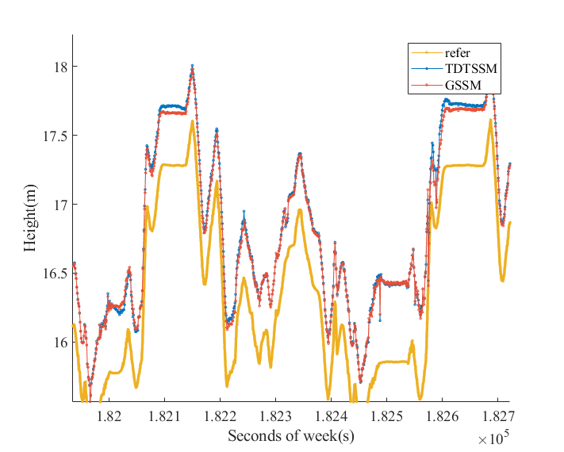
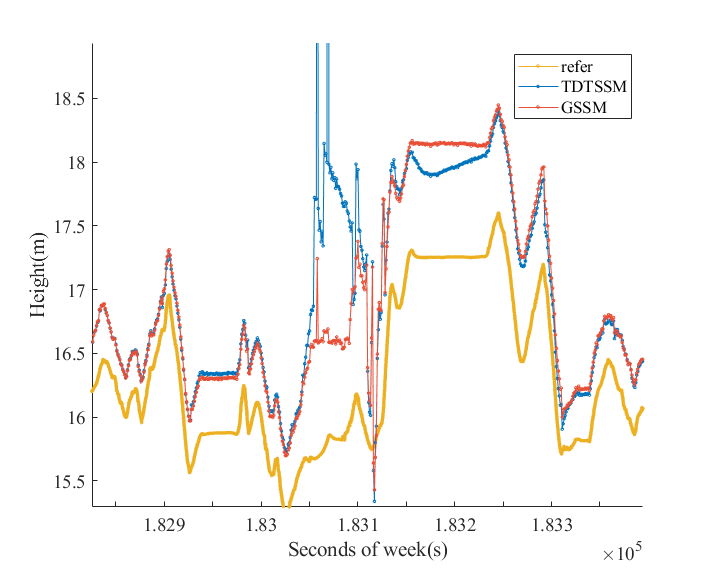
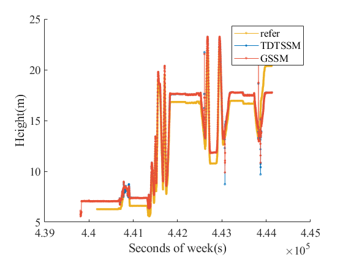
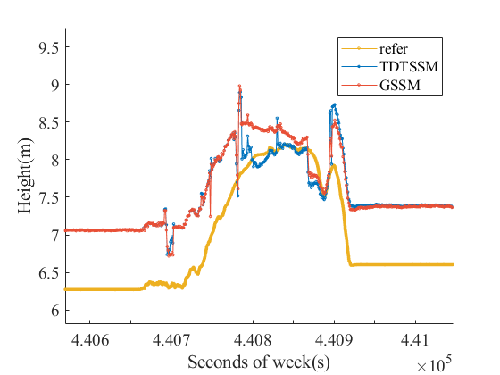
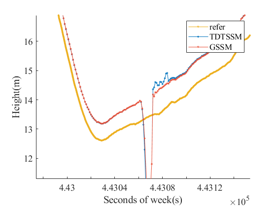
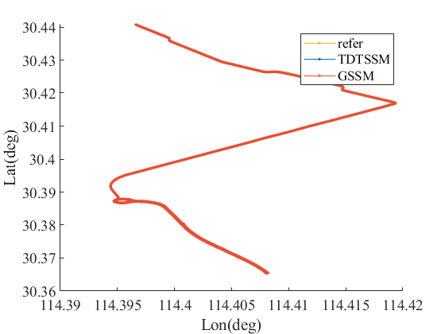

# Rtk in GSS

This project contains the open source codes for the papers "[[Real-time Kinematic Positioning Algorithm in Graphical State Space](https://www.ion.org/publications/abstract.cfm?articleID=18676)]" and "[[Global RTK Positioning in Graphical State Space](https://www.ion.org/publications/abstract.cfm?articleID=18519)]". 
The two papers have been presented at ITM 2023 and ION GNSS+ 2022. 
If you use this code for your research, please cite our papers.

Ge, Yihong, Yan, Sudan, Lü, Shaolin, Li, Cong, "Global RTK Positioning in Graphical State Space," Proceedings of the 35th International Technical Meeting of the Satellite Division of The Institute of Navigation (ION GNSS+ 2022), Denver, Colorado, September 2022, pp. 2767-2776.[https://doi.org/10.33012/2022.18519](https://doi.org/10.33012/2022.18519)

Yan, Sudan, Lü, Shaolin, Liu, Gang, Zhan, Yiding, Lou, Jianan, Zhang, Rong, "Real-time Kinematic Positioning Algorithm in Graphical State Space," Proceedings of the 2023 International Technical Meeting of The Institute of Navigation, Long Beach, California, January 2023, pp. 637-648.[https://doi.org/10.33012/2023.18676](https://doi.org/10.33012/2023.18676)

The library was built in Ubuntu 16.04.  
The results may be different for different OS. If any problem was found by you, please propose an issue or report it to 4050627@qq.com. The RTK part was modified from RTKlib to C++ style. 


This code realizes RTK in Graphical State Space in sliding window graph and global graph. It consists of the following factors:

* Priori Factor for the fixed-solution position and double-difference ambiguities.

* Double-difference carrier wave measurement factor. 

* Double-difference pseudo-range measurement factor.

* Single difference Doppler frequency measurement factor.

* State prediction factor for the dynamic state vector



# How to use this project

### 1)Required

* CMake --> sudo apt-get install cmake

* Boost --> sudo apt-get install libboost-all-dev

* Eigen --> sudo apt-get install libeigen3-dev​ sudo cp -r /usr/local/include/eigen3 /usr/include

* Intel TBB (optional)->sudo apt-get install libtbb-dev

* [gtsam](https://github.com/borglab/gtsam) --> git clone https://github.com/borglab/gtsam.git and Install gtsam, gtsam 3.2.3

* [IntelMkl](https://software.intel.com/content/www/us/en/develop/tools/oneapi/components/onemkl.html)(optional)

### 2）Clone repository to local machine

* RTKinGSS -->git clone https://github.com/shaolinbit/RTKinGSS

### 3)Build

```bash
cd RTKinGSS

mkdir build && cd build

​cmake ..

​make
```

### 4)Test

```bash
cd ../bin

./Rtkpost_gtsam
```

The test data file is in the data file folder.

There will be a test result under the path declared through object ```GSS_sildwin_result_file```. 

```cpp
GSS_slidwin_result_file="../data/Project 200602/gtsam_GSS_sildwin_result_elmask_15.txt";
GSS_global_result_file="../data/Project 200602/gtsam_GSS_global_result_elmask_15.txt";
rtklib_ekf_result_file="../data/Project 200602/gtsam_rtklib_ekf_result_elmask_15.txt";
```

If you want to run your data, change the file path in ```RTKpost()```

Input file (RINEX):

- rover_path:  observation file path of rover station.

- base_path: observation file path of base station.

- nav_path: navigation file path.

Output file (txt):

- GSS_sildwin_result_file: sliding window GSS factor graph result output in this path.  

- GSS_global_result_file: global window GSS factor graph result output in this path. 

- rtklib_ekf_result_file: EKF result output in this path. 

If you want to calculate the global factor graph, change the ```int flag_global``` to 1, which is declared in the file ```global.cpp```

If you want to change the sliding window size, change ```int slidwin_size```  which is declared in the file ```global.cpp```

Change the ```opt_gnss_mutifreq.conf``` file in folder ./rtk you can choose the satellite system and frequency you want, and set other options.


### 5）sample data result

There are two sample data under the folder test_data_result. The sliding window size is 10 epochs and the elevation mask is 15 deg.

#### result of 200602



#### result of 170707




